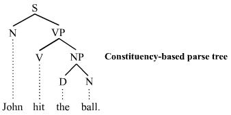

# Text Analyzer

`text_analyzer.py` is a tool that extracts key statistics over a set of texts (see **Output** section below) . These key statistics can be used to compare different texts, for example, reading difficulty (see **Output** section below). 

## How to Use

This `Python` script uses Natural Language Processing (NLP) to measure the reading level of different texts.

You can use `text_analyzer.py` with the following steps:

* Make sure all necessary `Python` libraries have been installed on your computer (see below for a list)

* Find texts that you want to analyse and save them as `.txt` files inside of a single directory

* From the terminal, go to the folder containing your copy of this repository

* Enter the following into the terminal:

  ```bash
  python3 text_analyzer -input DIRECTORY -limit CHARACTER_LIMIT -gpu USE_GPU
  ```

  where:

  * `DIRECTORY` (mandatory) is the directory where you stored the texts you want to analyze
  * `CHARACTER_LIMIT` (optional, default=10000) is the number of characters you want to limit the analysis to (default = 10000)
  * `USE_GPU` (optional, default=False) whether you want the underlying NLP engine (`spaCy`) to try and use your GPU to accelerate calculations. This is useful over a large number of texts, or when you character limit is large. 

## Output

The script will output two main files in the `results` folder:

* `text_statistics.csv` contains the following statistics  about each text that was passed:

  * `num_words`: the total number of words

  * `word_len_sd`: the standard deviation in the number of characters in a word

  * `word_len_mean`: the average number of characters in a word

  * `vocab`: the total number of unique word tokens

  * `vocab_noun`: the total number of unique word tokens that are nouns

  * `vocab_descriptors`: the total number of unique tokens that are descriptors (verbs, adverbs, adjectives)

  * `vocab_norm`: the total number of unique word tokens, normalised with respect to the total number of tokens

  * `vocab_noun_norm`: the total number of unique word tokens that are nouns, normalised with respect to the total number of tokens

  * `vocab_descriptors_norm`: the total number of unique tokens that are descriptors (verbs, adverbs, adjectives), normalised with respect to the total number of tokens

  * `sent_len_mean`: the average length of a sentence

  * `dep_depth_mean`: the average dependency depth of a word. This is calculated based on how many tokens a given word is dependent on as a part of speech. So, for example, in the parsing tree below,  the word 'ball' has a dependency depth of 2. This measures the grammatical complexity of a sentence since the deeper a parsing tree is, the more (other) words a reader needs to keep in mind at any one time in order to make sense of a given word.

    

  * `dep_depth_sd`: the standard deviation in the average dependency depth.

* `Bar Chart of Reading Difficulty.pdf`: this contains a bar chart comparing key statistics that reflect how hard it is to read something across the first 5 texts that were giving to `text_analyzer`. All scores are normalised with the highest being given the value of `1`. Below is an example:

  

  This enables interesting observations, such as the fact that word length and vocabulary are only significantly lower in *Dr Jekyll and Mr Hyde*, but that **Grammar** (ie average dependency depth), gets simpler and simpler as you go through the texts. 

## System Requirements

The following software needs to be installed in order for you to use 

* `Python` >= 3.6
* Python libraries:
  * `spaCy` (see [here](https://spacy.io/))
  * `numpy`
  * `re`